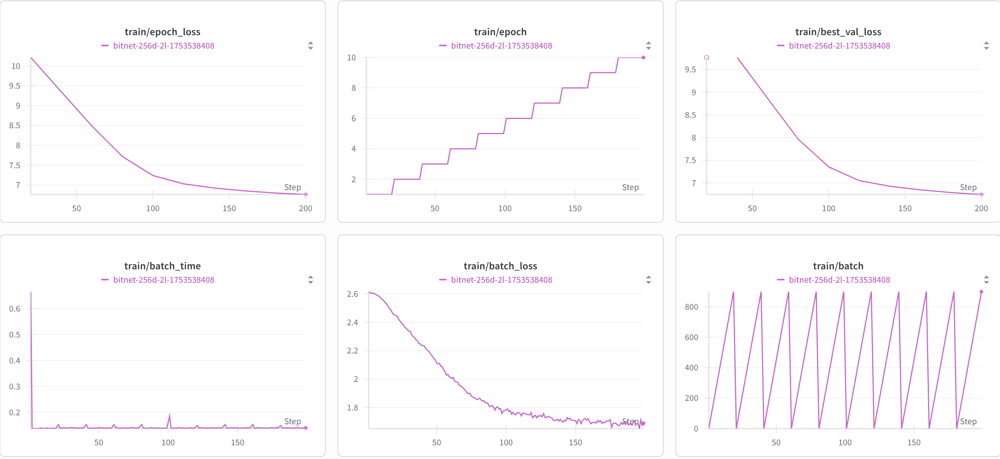

# BitText

**BitText** is a research-oriented and experimental repository focused on the exploration of **Bit Quantized Models** for both **NLP (BitText)** and **Vision (BitText)** tasks. The aim is to develop compact, efficient transformer-based models through extreme quantization (e.g., 1–4 bits) while maintaining competitive performance.

This repo includes:

* **BitText**: A BitNet-style Transformer for text-based tasks using low-bit quantized layers.
* **BitText** *(Coming soon)*: A Vision Transformer (ViT)-inspired architecture adapted to Bit-level quantization.
* Future direction: A unified **Bit-VLM (Vision-Language Model)** leveraging BitQuantization for multi-modal tasks.

---

## 🧠 Motivation

Modern deep learning models are powerful but resource-intensive. Quantization—especially extreme quantization—can drastically reduce model size and inference cost. This project explores:

* Whether BitNet-style architectures are viable for both NLP and vision.
* How much performance is retained under aggressive bit quantization.
* How to scale such models in training and deployment environments.

---

## 📁 Repository Structure

### ✅ BitText (Working)

```
bitText/
├── data/
│   ├── __init__.py            # Data loading utilities
│   ├── dataset.py             # Custom dataset class for Hugging Face datasets
│   ├── tokenizer.py           # Tokenization logic
│   └── prepare_data.py        # Preprocessing and dataset preparation
│
├── models/
│   ├── __init__.py            # Initialize model module
│   ├── transformer.py         # Transformer model definition using BitNet-style architecture
│   ├── layers.py              # Custom low-bit layers (e.g., BitLinear)
│   └── utils.py               # Quantization utilities, scaling, initialization
│
├── training/
│   ├── __init__.py            # Initialize training module
│   ├── train.py               # Training loop with metrics tracking and checkpointing
│   ├── eval.py                # Evaluation loop (perplexity, accuracy, etc.)
│   ├── config.py              # Configs for hyperparameters, paths, bit-width, model settings
│   └── checkpoints/           # Saved models during and after training
│
├── logs/
│   └── training_logs.log      # Logging training loss, val metrics, and debug info
│
├── results/
│   ├── model_outputs/         # Final model weights and sample predictions
│   ├── validation_results/    # Saved validation losses, metrics (perplexity, accuracy)
│   └── figures/               # Plots like training loss curve, quantization error
│
├── scripts/
│   ├── run_training.sh        # Shell script to kick off training
│   └── run_eval.sh            # Shell script to run model evaluation
│
├── requirements.txt           # All necessary Python packages
├── README.md                  # Project documentation (this file)
└── .gitignore                 # Ignore logs, checkpoints, etc.
```

---

## 📷 BitText (Planned)

* Architecture inspired by **Vision Transformers (ViT)**.
* Adapts core ViT components (patch embedding, MLP, attention) into **low-bit quantized layers**.
* Will include:

  * Image dataset support (e.g., CIFAR-10, ImageNet subsets)
  * Training and evaluation pipelines
  * Visualization of patch attention and quantization degradation

---

## 🔁 BitVLM: Bit Quantized Vision-Language Model (Planned)

The final goal of the repository is to integrate BitText and BitText into a **Vision-Language Model** (e.g., CLIP-style):

* Unified architecture for image-caption, image-question, or multi-modal tasks.
* Focus on extremely lightweight inference—ideal for edge devices and embedded systems.

---

## 🚀 Getting Started

### 1. Clone the Repository

```bash
git clone https://github.com/yourusername/BitText.git
cd BitText/bitText
```

### 2. Install Requirements

```bash
pip install -r requirements.txt
```

### 3. Prepare Data

For example, to prepare a HuggingFace dataset:

```bash
python data/prepare_data.py --dataset_name wikitext
```

Or define your dataset in `dataset.py`.

### 4. Train BitText

```bash
bash scripts/run_training.sh
```

Or directly:

```bash
python training/train.py --config training/config.py
```

### 5. Evaluate

```bash
bash scripts/run_eval.sh
```

---

## 🧪 Features

* BitNet-style transformer for NLP
* Custom low-bit `BitLinear` layers
* Configurable bit-widths (1–8 bits)
* Pluggable training pipeline with logging and checkpointing
* HuggingFace-compatible dataset loading

---

## 🛠️ Dependencies

Core libraries:

* `torch`
* `transformers`
* `datasets`
* `numpy`
* `tqdm`
* (Optional) `wandb` for logging

All dependencies are listed in `requirements.txt`.

---

## 📈 Results

### [All results are at Weights and Biases](https://wandb.ai/srddev/BitText/overview)

* Loss curves across bit-widths
* Comparison between float vs quantized models
* Visualizations of quantization error

---

## 💡 Research References

* [BitNet: Bit-Quantized Transformer Networks](https://arxiv.org/abs/2310.11453)
* [ViT: An Image is Worth 16x16 Words](https://arxiv.org/abs/2010.11929)
* [Quantization Techniques in Deep Learning](https://arxiv.org/abs/1712.05877)

---

## 🙌 Contributing

Contributions are welcome! To contribute:

1. Fork this repo
2. Create a new branch
3. Submit a pull request with a detailed description

---

## 📄 License

MIT License. See `LICENSE` file for details.
